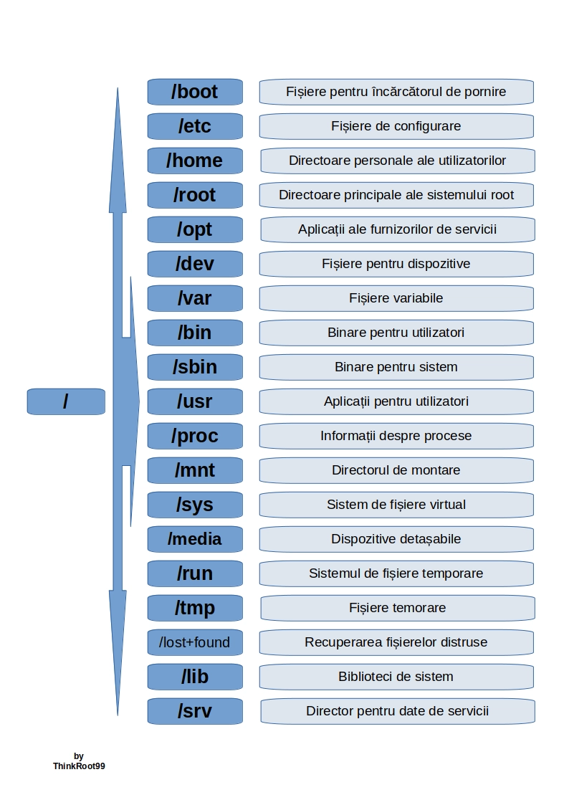

% Explicarea structurii directoarelor Linux și căilor fișierelor importante
% by ThinkRoot99

**Pe scurt: Acest articol oferă o prezentare a sistemului de fișiere din Linux/structurii de directoare, a unora dintre fișierele critice, a modului de utilizare și a locației acestora.**

Probabil că ați auzit că în UNIX și în derivatele UNIX, cum ar fi Linux, totul este considerat un fișier. Dacă nu este un fișier, atunci trebuie să fie un proces în execuție.

Există trei categorii mari de fișiere în Linux.

- **Fișiere generale** - Acestea sunt fișiere obișnuite formate din date binare sau ASCII. Acestea sunt fișiere obișnuite, cum ar fi documente, imagini, fișiere audio și video etc.
- **Fișiere de directoare** - În Linux, directoarele sunt, de asemenea, clasificate ca fișiere, deoarece acestea servesc și ca spațiu de stocare pentru alte fișiere și directoare.
- **Fișiere de dispozitive** - Acestea sunt fișiere speciale care oferă o interfață pentru drivere-le de dispozitive care permit utilizarea dispozitivelor hardware de pe sistem, cum ar fi mouse-uri, tastaturi, dispozitive USB, hard disk-uri etc. Acestea se găsesc în directorul `/dev`.

# Diagrama structurii directoarelor Linux

O distribuție Linux standard urmează structura directoarrelor, așă cum este prezentată mai jos, cu o diagramă și explicații.

> 

Fiecare dintre directoarele de mai sus (care este un fișier, în primul rând) conține informații importante, necesare pentru pornirea drivere-lor de dispozitive, fișiere de configurare etc.

Mai jos este descrierea pe scurt a destinației fiecărui director, vom începe ierarhic.

### Directorul /

Direcotrul root, notat cu o singură bară oblică (`/`), este cel mai înalt director din structura directoarelor Linux. Acesta conține toate directoarele, subdirectoarele și fișierele de pe sistemul Linux. De la directorul root începe ierarhia directoarelor Linux.

> Notă: Directorul root (`/`) nu trebuie confundat cu directorul principal (`/root`).

### Directorul /boot

Acesta este unul dintre cele mai importante directoare dintr-un sistem Linux. După cum sugerează numele, directorul de boot conține fișierele de boot pentru Linux, cum ar fi încărcătorul de pornire (bootloader), nucleul și fișierele asociate acestuia. Fișiere precum `vmlinuz` reprezintă imaginea comprimată a nucleului Linux.

### Directorul /etc

Directorul **/etc** conține fișiere de configurare a sistemului pentru toate serviciile, scripturile și aplicațiile terțe care sunt instalate. Acest director este considerat centrul nervos al sistemului Linux.

### Directorul /home

Directorul **/home** este un director care conține directoarele și fișierele personale ale unui utilizator. Pe un sistem grafic, directorul home conține, în mod implicit, dosare precum Desktop, Documents, Downloads, Pictures, Video și Public.

În plus, directorul **/home** conține fișiere de configurare personală care sunt marcate cu un punct (`.`) în fața numelui. Aceste fișiere ascunse care conțin setări specifice utilizatorului pentru sesiunea de conectare la shell.

### Directorul /root

Directorul **/root** este directorul principal al utilizatorului root, care este denumit și directorul principal al utlilizatorului root (și nu directorul root (`/`)).

Contul root, denumit și superutilizator, utilizator administrativ, administrator de sistem sau pur și simplu utilizator root, are acces la toate comenzile și fișierele de sistem din Linux.

### Directorul /opt

Directorul **/opt** este un director rezervat pentru pachetele adiționale și aplicațiile informatice terțe care nu sunt incluse în mod implicit în depozitele oficiale ale sistemului.

De exemplu, atunci cănd instalați aplicații precum Skype, Discord, Spotify și Java, pentru a menționa doar câteva, acestea sunt stocate în directorul **/opt**.

### Directorul /dev

Directorul **/dev** conține fișiere de dispozitiv sau fișiere speciale pentru dispozitivele care sunt atașate la sistem, cum ar fi unitatea hard disk, tastatura sau mouse-ul. După cum s-a menționat, nu sunt fișiere obișnuite pe care utilizatorul le poate citi sau scrie.

Acestea sunt abstracții ale dispozitivelor standard cu care interacționează aplicațiile de pe sistem prin intermediul apelurilor de sistem de instrare și ieșire.

### Directorul /var

Directorul **/var** stochează fișierele variabile generate de sistem, care includ fișiere jurnal, cache-uri și fișiere spool, pentru a menționa doar câteva.

### Directorul /bin

Directorul **/bin** conține fișiere binare pentru utilizator, programe executabile și comenzi de sistem comune care sunt utilizate de toți utilizaotrii sistemului. Printre acestea se numără ls, pwd, cat, mkdir, cd, mv, cp, du, df, tat, rpm, wc, history, etc.

### Directorul /sbin

Directorul **/sbin** conține fișierele executabile, utilitare și comenzi de sistem care sunt rezervat utilizatorului root sau unui utilizator cu privilegii root. Astfel de comenzi sunt: hatl, reboot, mkfs, fsck, fdisk, iptables, ifconfig, ip, swapon, etc.

### Directorul /usr

Directorul **/usr** este unul dintre cele mai importante directoare datorită cantității enorme de date pe care le conține. Directorul conține fișiere numai pentru citire la nivelul întregului sistem. Printre acestea se numără biblioteci, fișiere binare pentru utilizator și documnetația acestora, programe și utilitare de sistem.

### Directorul /proc

Directorul **/proc** este un director oarecum ciudat. Este un sistem de fișiere virtual sau pseudo-sistem de fișiere care conține informații vitale despre procesele în curs de control și de informații pentru nucleul Linux.

Sistemul de fișiere este creat din mers la pornirea sistemului și este distrus odată ce sistemul este oprit.

### Directorul /mnt

Directorul **/mnt**, împreună cu subdirectoarele sale, este un director destinat a fi utilizat ca punct de montare temporară pentru montarea dispozitivelor de stocare, cum ar fi unități de hard disk, unități USB și CDROM-uri.

### Directorul /sys

Directorul **/sys** este un sistem de fișiere virtual care conține un set de fișiere virtuale care oferă o interfață cu nucleul Linux.

### Directorul /media

Directorul **/media** este un director în care sistemul montează mediile detașabile, cum ar fi unitățile USB.

### Directorul /run

Directorul **/run** este un sistem de fișiere temporar care conține date volatile de execuție, care arată datele de funcționare ale sistemului de când a fost inițiat. Fișierele din directorul **/run** trebuie să fie șterse (eliminate sau trunchiat, dupa caz) la începutul procesului de pornire.

### Directorul /tmp

Directorul **/tmp** este un director care stochează fișiere temporare și multe programe folosesc acest director pentru a crea fișiere de blocare și pentru a păstra stocarea temporară a datelor.

Nu ștergeți fișierele din directorul **/tmp** decât dacă știți exact ce faceți! Multe dintre acesste fișiere sunt critice pentru programele care rulează în prezent și eliminarea lor poate afecta sistemul.

### Directorul /lib

Directorul **/libe** stochează toate bibliotecile standard esențiale necesare pentru binarele tilizatorului din directorul **/bin**.

### Directorul /lost+found

Directorul **/lost+found** este instalat în timpul instalării sistemului Linux, fiind util pentru recuperarea fișierelor care pot fi distruse din cauza unei închideri neașteptate.

### Directorul /srv

Directorul **/srv** este directorul de servicii și este prescurtate „***srv***”. Acest director conține fișiere specifice serverului și fișiere legate de servicii.

# Explorarea fișierelor importante, locația și capacitatea de utilizare a acestora

Linux este un sistem complex care necesită o modalitate mai complexă și mai eficientă de a **porni**, **opri**, **înreține** și **reporni** un sistem, spre deosebire de Windows. În Linux există un **fișier de configurare** bine definit, **fișiere binare**, **pagini de manual**, **fișiere cu informații** etc. pentru fiecare **proces**.

Pe lângă directoarele principale, mai există o listă cu unele dintre fișierele și directoarele importante și cu utilizările acestora.

- **/boot/vmlinuz**: Fișierul nucleului Linux.
- **/dev/hda**: Fișier de dispozitiv pentru primul HDD IDE (Hard Disk Drive).
- **/dev/hdc**: Fișier de dispozitiv pentru CDROM IDE, de obicei.
- **/dev/sda**: Fișier de dispozitiv pentru prima unitate SATA (Hard Disk Drive).
- **/dev/null**: Un pseudo-dispozitiv, care nu există. Uneori, ieșirea gunoiului este redirecționată către **/dev/null**, astfel încât se pierde, pentru totdeauna.
- **/etc/bashrc**: Acest fișier conține valori implicite, funcții și alias-uri la nivelul întregului sistem, printre alte fișiere care sunt utilizate de toți utilizatorii sistemului.
- **/etc/crontab**: Acesta este un fișier la nivel de sistem care este formatat în mod unic pentru a programa sau automatiza sarcinile de sistem pe un sistem Linux.
- **/etc/exports**: Este un fișier care determină ce sisteme de fișiere sunt exportate către gazde la distanță și specifică opțiunile.
- **/etc/fstab**: Acesta este un fișier special care conține informații despre toate punctele de montare disponibile și opțiunile pentru punctele de montare. Fiecare linie din acest fișier oferă șase opțiuni, fiecare dintre acestea denotă informații despre un punct de montare sau un sistem de fișiere.
- **/etc/hosts**: Acesta este un fișier de configurare care mapează numele de gazdă ale sistemului cu adresele IP corespunzătoare.
- **/etc/hosts.allow**: Acest fișier specifică ce gazde au permisiunea de a se conecta la sistemul local.
- **/etc/hosts.deny**: Fișierul specifică gazdele cârora li se refuză accesul și serviciile pe mașina locală.
- **/etc/issue**: Conține un mesaj de pre-login.
- **/etc/modules**: Acest fișier conține numele modulelor de nucleu care trebuie încărcate la pornire, câte unul pe linie.
- **/etc/motd**: motd reprezintă mesajul zilei, mesajul pe care utilizatorii îl primesc la conectare.
- **/etc/mtab**: Un fișier numai pentru citire care conține o listă a sistemelor de fișiere montate în prezent.
- **/etc/passwd**: Un fișier care conține informații despre utilizatorul sistemului, cum ar fi numele de utilizator, UID,GID și shell-ul de conectare, printre altele.
- **/etc/printcap**: Conține informații despre imprimante care sunt generate de fișierul **/etc/cups/printers.conf**.
- **/etc/profile**: Conține mediul de sistem Linux și alte scripturi de pornire.
- **/etc/profile.d**: Script de aplicație, executat după autentificare.
- **/etc/rc.d**: Informații despre scripturile specififce nivelului de execuție.
- **/etc/rc.d/init.d**: Script de inițializare a nivelului de execuție.
- **/etc/resolv.conf**: Acesta este un fișier de rezolvare a DNS. Acesta specifică modul în care sistemul utilizează DNS pentru a rezolva numele de gazdă.
- **/etc/security**: Conține fișiere de configurare pentru diverse module PAM.
- **/etc/skel**: Acesta este un director care conține un set de fișiere de configurare a utilizatorilor care sunt copiate în directorul de origine a utilizatorului atunci când este creeat un utilizator.
- **/etc/X11**: Acesta este un director care conține fișiere de configurare pentru sistemul X-windows.
- **/usr/bin**: Comenzi executabile normale de utilizator.
- **/usr/bin/X11**: Acest director conține directoare și binare pentru sistmeul X-windows, care se îmbină la infinit.
- **/usr/include**: Acest director conține fișiere de antet (header files) pentru comilatoare C. Acesta include `stdio.h`, `stdlib.h` și `string.h`, printre altele.
- **/usr/share**: Directoare partajate de fișiere man (man files), fișiere de informații (info files), etc.
- **/usr/lib**: Acest director este format din fișiere și directoare de obiecte (object files).
- **/usr/sbin**: Directorul conține binare cu privilegii de superutilizator sau pentru administrarea sistemului.
- **/proc/cpuinfo**: Fișierul conține informații despre sistem, inclusiv modeul CPU, numele modelului, numărul de nuclee și viteza ceasului, pentru a menționa câteva fișiere.
- **/proc/interrupts**: Informații despre întreruperile utilizate în prezent.
- **/proc/ioports**: Fișierul conține toate adresele de intrare/ieșire utilizate de dispozitivele de pe server.
- **/proc/meminfo**: Fișier care stochează informații despre utilizarea memoriei, inclusiv informații despre swap.
- **/proc/modules**: Un fișier care listează toate modulele utilizate de nucleul.
- **/proc/mount**: Fișier care conține informații detaliate despre sistemul de fișiere montate.
- **/proc/stat**: Fișierul conține informații detaliate despre activitatea sistemului și a nucleului.
- **/proc/swap**: Fișierul conține informații despre fișierul swap.
- **/proc/version**: Fișierul conține informații despre versiunea Linux.
- **/var/log/lastlog**: Un fișier binar care conține informații despre ultimele autentificări reușite ale utilizatorilor.
- **/var/log/messages**: Fișierul conține un jurnal al mesajelor produse de daemonul syslog la pornire.

# Sugestii pentru articol

**Sugestiile pentru actualizarea sau corectarea articol-ului se pot face pe [GitHub](https://github.com/thinkroot99/articole-linux). Mulțumesc**