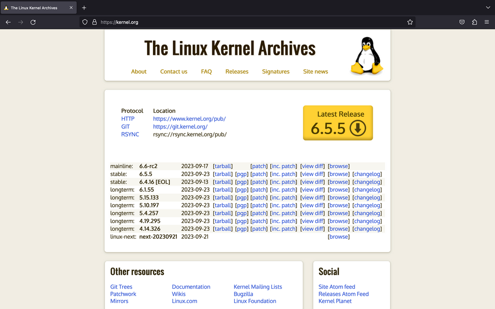

% Un ghid de compilare a nucleului Linux
% ThinkRoot99

Un ghid de utilizare pentru a experimenta singur compilarea celui mai recent nucleu Linux.

Este posibil să fiți interesați să compilați singuri nucleul Linux, din mai multe motive. Acestea pot fi, dar nu se limitează la, unul dintre următoarele:

- Încercarea unui nucleu mai nou decât cel furnizat de distribuția GNU/Linux.
-  Construirea nucleului cu un set diferit de opțiuni de configurare și/sau drivere.
-  Curiozitatea unui novice :)

Acest ghid vă va arăta cum puteți compila singur nucleul Linux, care sunt comenzile pe care trebuie să le utilizați, de ce trebuie să le utilizați și explicații despre ce anume fac aceste comenzi.

**Acesta este un ghid lung, așa că pregătiți-vă bine!**

# Condiții prealabile

Există două condiții prealabile pentru a construi ceva (în ceea ce privește programele).

1. Codul sursă
2. Dependențele de compilare 

Așadar, ca precondiții, vom descărca sursa nucleului Linux sub formă de tarball și vom instala câteva dependențe care ne vor permite să construim nucleul Linux.

## Abecedar cu privire la versiunile Linux

La un moment dat, există 4 „***versiuni***” ale nucleului Linux.

Aceste „***versiuni***” de Linux, în ordinea fluxului de dezvoltare, sunt:

1. **Arborele linux-next** (linux-next tree): Orice cod care urmează să fie îmbinat în baza de cod Linux este mai întâi îmbinat în arborele `linux-next`. Acesta este cel mai nou, dar și „***cel mai puțin stabil***” stadiu al nucleului Linux. Cei mai mulți dezvoltatori și testeri ai nucleului folosesc acest arbore pentru a rafina calitatea codului din care Linus va extrage mai târziu.
2. **Versiunea RC/Mainline**: Linus extrage din arborele `linux-next` și creează o versiune inițială. Versiunea beta a acestei versiuni se numește RC (Release Candidate). Odată ce o versiune RC este lansată, Linus acceptă doar corecții de defecte și remedieri legate de regresia performanței. Linus continuă să lanseze un nucleu RC în fiecare săptămână până când este mulțumit de cod (cu observațiile primite de la utilizatori). Sufixul `-rc`, urmat de un număr, este adăugat pentru a indica versiunea de lansare RC.
3. **Versiunea stabilă**: Odată ce Linus consideră că ultima versiune RC a fost stabilă, el publică versiunea finală. O versiune stabilă este menținută pentru încă câteva săptămâni. Aceasta este ceea ce folosesc distribuțiile GNU/Linux de ultima oră, precum Arch Linux și Fedora Linux.
4. **Versiunea LTS**: Ultima versiune stabilă a unui anumit an este menținută pentru încă câțiva ani. Aceasta este de obicei o versiune mai veche, dar întreținută în mod activ cu remedieri de securitate. O versiune stabilă a Debian utilizează versiunea LTS a nucleului Linux.

Puteți citi mai multe despre acest lucru în [documentația oficială](https://www.kernel.org/category/releases.html).

În cadrul acestui articol, voi folosi cea mai recentă versiune stabilă disponibilă. Care, la momentul scrierii acestui articol, se află la v6.5.5.

# Pregătirea sistemului

Deoarece nucleul Linux este scris în limbajul de programare C, aveți nevoie cel puțin de un compilator C pentru a compila nucleul. Există și alte dependențe de acest tip care ar putea fi sau nu prezente în calculatorul dumneavoastră. Este timpul să le instalați pe acestea.

> Acest ghid se va concentra pe compilarea nucleului Linux folosind GNU C Comipler (GCC).

Comanda de instalare pentru utilizatorii Arch Linux și derivtele sale:

    sudo pacman -S base-devel bc coreutils cpio gettext initramfs kmod libelf ncurses pahole perl python rsync tar xz

Comanda de instalare pentru utilizatori de Debian și derivatele sale:

    sudo apt install bc binutils bison dwarves flex gcc git gnupg2 gzip libelf-dev libncurses5-dev libssl-dev make openssl pahole perl-base rsync tar xz-utils

Comanda de instalare pentru Fedora și derivatele sale:

    sudo dnf install binutils ncurses-devel \
    /usr/include/{libelf.h,openssl/pkcs7.h} \
    /usr/bin {bc,bison,flex,gcc,git,gpg2,gzip,make,openssl,pahole,perl,rsync,tar,xz,zstd}

## Obținerea sursei nucleului Linux

Mergeți la [kernel.org](https://kernel.org/) și găsiți pe pagină prima versiune stabilă. Nu ai cum să o ratezi, deoarece este cel mai mare buton galben ;)

> [Accesați kernel.org](https://kernel.org/)

> 

Puteți descărca tarball-ul făcând clic pe butonul mare galben. Dacă tot sunteți aici, descărcați și fișierul cu semnătura PGP corespunzătoare. Acesta va fi util atunci când vom verifica tarball-ul la un moment dat. Acesta are extensia `.tar.sign`.

### Verificarea autenticității pachetului tar

Cum știți dacă tarball-ul pe care tocmai l-ați descărcat este corpt sau nu? La nivel individual, un tarball corupt nu va face decât să vă irosească timpul de lucru, dar dacă acest lucru este făcut pentru o organizație, s-ar putea să ușurați lucrurile pentru un atacator.

Pentru a verifica integiratea tarball-ului nostru, avem nevoie de un tarball. În acest moment, acesta este comprimat folosind algoritmul de compresie XZ. Prin urmare, voi folosi utilitarul `unxz` (un simplu alias pentru `xz --decompress`) pentru a decomprima fișierul de arhivă `.tar.xz`.

    unxz --keep linux-*.tar.xz

Odată extras, vom extrage cheile GPG publice pe care le folosesc Linus Torvalds și Greg KH. Aceste chei sunt folosite pentru a semna tarball-ul.

    gpg2 --locate-keys torvalds@kernel.org gregkh@kernel.org

Ar trebui să obțineți un rezultat similar cu cel din exemplul următor:

    $ gpg2 --locate-keys torvalds@kernel.org gregkh@kernel.org
    gpg: /home/thinkroot99/.gnupg/trustdb.gpg: trustdb created
    gpg: key 38DBBDC86092693E: public key "Greg Kroah-Hartman <gregkh@kernel.org>" imported
    gpg: Total number processed: 1
    gpg:               imported: 1
    gpg: key 79BE3E4300411886: public key "Linus Torvalds <torvalds@kernel.org>" imported 
    gpg: Total number processed: 1
    gpg:               imported: 1
    pub   rsa4096 2011-09-23 [SC]
          647F28654894E3BD457199BE38DBBDC86092693E
    uid           [ unknown] Greg Kroah-Hartman <gregkh@kernel.org>
    sub   rsa4096 2011-09-23 [E]
    
    pub   rsa2048 2011-09-20 [SC]
          ABAF11C65A2970B130ABE3C479BE3E4300411886
    uid           [ unknown] Linus Torvalds <torvalds@kernel.org>
    sub   rsa2048 2011-09-20 [E]

Odată ce cheile lui Greg și Linus sunt importate, integritatea tarball-ului poate fi verificată cu ajutorul indicatorului `--verify` astfel:

    gpg2 --verify linux-*.tar.sign

Dacă verificarea a fost efectuată cu succes, ar trebui să obțineți o informație similară cu cea de mai jos:

    $ gpg2 --verify linux-*.tar.sign
    gpg: assuming signed data in 'linux-6.5.5.tar'
    gpg: Signature made Saturday 23 September 2023 02:46:13 PM IST
    gpg:                using RSA key 647F28654894E3BD457199BE38DBBDC86092693E
    gpg: Good signature from "Greg Kroah-Hartman <gregkh@kernel.org>" [unknown]
    gpg: WARNING: This key is not certified with a trusted signature!
    gpg:          There is no indication that the signature belongs to the owner.
    Primary key fingerprint: 647F 2865 4894 E3BD 4571  99BE 38DB BDC8 6092 693E

**Vă rog să nu continuați decât dacă vedeți un mesaj în care scrie: `gpg: Good signature!`**

> Puteți ignora cu siguranță avertismentul: ***WARNING: This key is not certified with a trusted signature! There is no indication that the signature belongs to the owner.***
  >
> Am preluat cheile din e-mail-urile lui Linus și Greg și nu trebuie să ne facem griji în legătură cu acest avertisment.

### Extragerea pachetului tar

Dacă ați ajuns aici, înseamnă că verificarea integrității tarball-ului dvs. s-a încheiat cu succes. Acum, este timpul să extragem sursa nucleului Linux din el.

Acest lucru este destul de ușor, trebuie doar să faceți `tar -xf` pentru tarball, astfel:

     tar -xf linux-*.tar

Indicatorul `-x` este utilizat pentru a specifica extracția, iar `tar` este informat cu privire la numele fișierului tarball folosind indicatorul `-f`.

Extracția va dura câteva minute.

# Configurarea nucleului Linux

Procesul de compilare a nucleului Linux caută un fișier `.config`. După cum sugerează și numele, acesta este un fișier de configurare care specifică toate opțiunile de configurare posibile pentru nucleul Linux. Este necesar să aveți unul.

Există două metode de a obține acest fișier `.config` pentru nucleul Linux:

1. Folosind ca bază configurația distribuției GNU/Linux (recomandat).
2. Utilizarea unei configurații implicite, generice.

> Există o a treia metodă prin care puteți configura fiecare opțiune manual (de la zero), dar **`atenție`** există peste 12.000 de opțiuni. Acest lucru nu este recomandat, deoarece este nevoie de mult timp pentru a configura totul manual și, de asemenea, de suficiente cunoștințe pentru a ști ce să activezi și ce să nu dezactivezi.

## Utilizarea configurației furnizate de distribuție

Utilizarea configurației furnizate de distribuția GNU/Linux este un pas sigur. Dacă urmați acest ghid doar pentru a încerca un nucleu nou față de cel oferit de distributia dvs., aceasta este metoda recomandată.

Fișierul de configurare al distribuției dvs. GNU/Linux pentru nucleul Linxu se va afla în oricare dintre cele două locuri:

- Cele mai multe distribuții GNU/Linux, cum ar fi Debian și Fedora, precum și derivatele lor, îl vor stoca astfel: `/boot/config-$(uname -r)`.
- Unele distribuții GNU/Linux, cum ar fi Arch Linux, îl au integrat în nucleul însuși. Prin urmare, va fi disponibil în `/proc/config.gz`.

> Dacă aveți ambele destinații disponibile, alegeți să folositi `/proc/config.gz`, deoarece se află într-un sistem de fișiere doar pentru citire și, prin urmare, nu este modificat.

Introduceți directorul care conține fișierul tarball extras.

    cd linux-*/

Apoi, copiați fișierul de configurare al distribuției GNU/Linux:

    ## Debian, Fedora și derivate:
    $ cp /boot/config-"$(uname -r)" .config
    
    ## Arch Linux și derivate:
    $ zcat /proc/config.gz > .config

### Actualizarea configurației

După ce s-a făcut acest lucru, este timpul să „***actualizați***” fișierul de configurare. Vedeți, există o mare probabilitate ca configurația furnizată de distribuția dvs. să fie mai veche decât nucleul Linux pe care îl construiți.

> Acest lucru este valabil și pentru distribuțiile GNU/Linux de ultimă generație precum Arch Linux și Fedora. Niciuna dintre ele nu lansează o actualizare doar pentru că există o nouă versiune disponibilă. Ei fac un control al calității, ceea ce va dura un timp. Și, prin urmare, chiar si cel mai recent nucleul oferit de distribuția dvs. va fi cu câteva versiuni minore în urmă, în comparație cu ceea ce veți obține de pe kernel.org.

Pentru a actualiza un fișier `.config` existent, se utilizează comanda `make` cu opțiunea `olddefconfig`. Defalcat, aceasta este vechea configurație implicită (`old` `def`ault `config`uration).

Acest lucru va lua „***vechiul fișier de configurare***” (care este salvat în prezent ca `.config` ca o copie literală a configurației distributiei dvs.) și va verifica dacă există noi opțiuni de configurare care au fost adăugate în baza de cod Linux de atunci.

În cazul în care sunt găsite opțiuni noi, neconfigurate, se utilizează valoarea de configurare implicită pentru opțiunea respectivă și fișierul `.config` este actualizat.

Fișierul `.config` orignal este redenumit în `.config.old` ca copie de rezervă, iar noile modificări sunt scrise în `.config`.

    make olddefconfig

În cele ce urmează este rezultatul unui exemplu:

    $ file .config
    .config: Linux make config build file, ASCII text
    
    $ make olddefconfig
      HOSTCC  scripts/basic/fixdep
      HOSTCC  scripts/kconfig/conf.o
      HOSTCC  scripts/kconfig/confdata.o
      HOSTCC  scripts/kconfig/expr.o
      LEX     scripts/kconfig/lexer.lex.c
      YACC    scripts/kconfig/parser.tab.[ch]
      HOSTCC  scripts/kconfig/lexer.lex.o
      HOSTCC  scripts/kconfig/menu.o
      HOSTCC  scripts/kconfig/parser.tab.o
      HOSTCC  scripts/kconfig/preprocess.o
      HOSTCC  scripts/kconfig/symbol.o
      HOSTCC  scripts/kconfig/util.o
      HOSTLD  scripts/kconfig/conf
    .config:8593:warning: symbol value 'm' invalid for USB_FOTG210_HCD
    .config:8859:warning: symbol value 'm' invalid for USB_FOTG210_UDC
    #
    # configuration written to .config
    #

### Pentru utilizatori de Debian și derivatele sale

Debian și derivatele sale utilizează un certificat pentru a semna modulele nucleului. Acest certificat, în mod implicit, este absent de pe calculatorul dumneavoastră.

Vă recomand să dezactivați opțiunea care permite semnarea modulelor. Acest lucru poate fi realizat cu următoarele comenzi:

    ./scripts/config --file .config --set-str SYSTEM_TRUSTED_KEYS ''
    ./scripts/config --file .config --set-str SYSTEM_REVOCATION_KEYS ''

**Dacă nu faceți acest lucru, veți avea ca rezultat un eșec de compilare mai târziu, când veți construi nucleul Linux.**

## Utilizarea unei configurații personalizate

Dacă învățați despre construirea nucleului Linux în scopul de a învăța dezvoltarea nucleului, aceasta este calea pe care trebuie să o urmați.

> Nu există nicio garanție că abaterea de la configurația distribuției Linux va funcționa „***normal***” pe hardware-ul fizic. Problema poate varia de la faptul că o anumită piesă hardware nu funcționează, până la faptul că nucleul Linux nu pornește de loc.
> 
> Prin urmare, este recomandat doar pentru utilizarea în interiorul unui VM.

Puteți arunca o privire la [rezultatul](https://www.kernel.org/doc/makehelp.txt) programului `make help` pentru a vedea toate opțiunile disponibile, dar ne vom concentra asupra a trei opțiuni ale `make`:

- `defconfig`: Configurația implicită.
- `allmodconfig`: Pe baza stării curente a sistemului, construiește elementele ca module încărcabile (în loc de built-in) atunci când este posibil.
- `tinyconfig`: Un mic nucleul Linux.

Deoarece ținta lui `tinyconfig` este să construiască doar câteva elemente, timpii de construcție sunt în mod natural mai rapizi. Se poate folosi și pentru una dintre următoarele motive:

1. Se poate verifica orice modificare în cod/toolchain dacă este corectă și dacă se compilează.
2. Testând doar câteva caracteristici selectate în înteriorul unui VM.

> Atunci când construiți nucleul Linux pentru mașini ARM sau RISC-V, cel mai probabil veți avea nevoie de DTB (device-tree binaries). `tinyconfig` nu va activa opțiunea de construirea a DTB și, cel mai probabil, nucleul dumneavoastră nu va reuși să pornească.
> 
> Totuși, puteți utiliza QEMU pentru a porni nucleul Linux fără DTB. Dar acest articol nu se va concentra asupra acestui obiectiv.

Ar trebui să folosiți `defconfig` dacă nu știți exact ce faceți. Iată cum arată într-un exemplu:

    $ make defconfig
      HOSTCC  scripts/basic/fixdep
      HOSTCC  scripts/kconfig/conf.o
      HOSTCC  scripts/kconfig/confdata.o
      HOSTCC  scripts/kconfig/expr.o
      LEX     scripts/kconfig/lexer.lex.c
      YACC    scripts/kconfig/parser.tab.[ch]
      HOSTCC  scripts/kconfig/lexer.lex.o
      HOSTCC  scripts/kconfig/menu.o
      HOSTCC  scripts/kconfig/parser.tab.o
      HOSTCC  scripts/kconfig/preprocess.o
      HOSTCC  scripts/kconfig/symbol.o
      HOSTCC  scripts/kconfig/util.o
      HOSTLD  scripts/kconfig/conf
    *** Default configuration is based on 'defconfig'
    #
    # configuration written to .config
    #

## Modificarea configurației

Ați creat un fișier `.config` utilizând o anumită metodă. Fie l-ați folosit pe cel pe care îl folosea distribuția Linux și l-ați actualizat, fie ați creat unul folosind opțiunea `deconfig`.

În orice caz, căutați cum să modificați configurația. Cea mai bună modalitate de a face acest lucru este prin intermediul `menuconfig` sau `nconfig`.

Ambele opțiuni fac același lucru, dar au o interfață diferită pentru dumneavoastră. Aceasta este singura diferență dintre ele. `nconfig` este puțin mai intuitiv în căutarea opțiunilor.

Începeți prin a rula comanda `make` cu opțiunea `menuconfig`:

    $ make menuconfig
      HOSTCC  scripts/kconfig/mconf.o
      HOSTCC  scripts/kconfig/lxdialog/checklist.o
      HOSTCC  scripts/kconfig/lxdialog/inputbox.o
      HOSTCC  scripts/kconfig/lxdialog/menubox.o
      HOSTCC  scripts/kconfig/lxdialog/textbox.o
      HOSTCC  scripts/kconfig/lxdialog/util.o
      HOSTCC  scripts/kconfig/lxdialog/yesno.o
      HOSTLD  scripts/kconfig/mconf

Acum, acolo, modificați opțiunile de configurare pentru a le selecta în funcție de tipul lor.

Există două tipuri de opțiuni care pot fi schimbate:

- Opțiuni cu stare booleană (boolean-state): Opțiuni care pot fi doar dezactivate `([])` sau activate, ca și cele încorporate `([*])`.
- Opțiuni cu trei stări (tri-state): Opțiuni care pot fi dezactivate `(<>)`, încorporate `(<*>)` sau construite ca modul încărcabil `(<M>)`.

Pentru a afla mai multe informații despre o opțiune, navigați până la aceasta cu ajutorul tastelor săgeată sus/jos și apoi apăsați tasta `Tab` până când este selectată opțiunea `<Help>` din partea de jos. Apoi, apăsați tasta `Enter` pentru a o selecta. Se va afișa un meniu de ajutor despre acel element al opțiunii de configurare.

**Vă rog să fiți atent atunci când modificați o opțiune**

După ce l-ați configurat după bunul plac, apăsați tasta `Tab` până când este selectată opțiunea `<Save>` din partea de jos. Apoi, apăsați tasta `Enter` pentru a o selecta. Apăsați din nou tasta `Enter` (fără a schimba numele fișierului) pentru a salva configurația actualizată în fișierul `.config`.

# Construirea nucleului Linux

Construirea nucleului Linux este simplă. Dar înainte de a face acest lucru, este necesar să etichetăm compilarea nucleului nostru personalizat. Vom folosi șirul de caractere `-thinkroot99` ca etichetă și ne vom folosi de variabila `LOCALVERSION` penru a face acest lucru. Se poate configura folosind următoarea comandă:

     ./scripts/config --file .config --set-str LOCALVERSION "-thinkroot99"

Acest lucru face ca opțiunea de configurare `CONFIG_LOCALVERSION` din fișierul `.config` să fie setată la șirul care este specificat la sfârșit, care, în cazul meu este `-thinkroot99`. Puteți să schimbați numele meu cu orice doriți :)

Opțiunea `LOCALVERSION` este utilizată pentru a seta o versiune „***locală***” care este adăugată la schema obișnuită de versiuni ***x.y.z*** și este afișată atunci când executați comanda `uname -r`.

Din moment ce construim nucleul 6.5.5 cu șirul `LOCALVERSION` setat la `-thinkroot99`, pentru mine, va fi `6.5.5-thinkroot99`. Acest lucru se face pentru a ne asigura că nucleul personalizat pe care l-am construit nu intră în conflict cu nucleul furnizat de distribuție.

Acum, să construim nucleul propriu-zis. Rulează comanda următoare pentru a face acest lucru:

    make -j$(nproc) 2>&1 | tee log

**Acest lucru este suficient pentru 99% dintre utilizatori.**

Opțiunea `-j` este utilizată pentru a specifica câte sarcini de compilare paralelă trebuie create. Iar `nproc` returnează un număr pentru cantitatea de unități de procesare care sunt disponibile (acesta include și firele de execuție). Astfel, `-j$(nproc)` înseamnă „***utilizează atâtea sarcini de compilare paralelă câte fire de procesare am***”.

`2>&1` va redirecționa `STDOUT` și `STDIN` către același descriptor de fișier, iar acesta va fi redirecționat către comanda `tee`, care va stoca rezultatul într-un fișier numit `log` și va imprima același text pe consolă.

Acest lucru se întâmplă în cazul în care vă veți lovi de un defect de compilare și doriți să vă uitați înapoi la jurnal pentru a verificat ce a mers prost. În acest caz, puteți face pur și simplu un `grep Error log`.

## Opțiuni personalizate pentru „make”

Există câteva opțiuni personalizate pe care le puteți utiliza cu comanda `make` pentru a efectua diverse operațiuni în directorul sursă al nucleului Linux.

Acestea sunt ca referință pentru dezvoltatori. Dacă singura dvs. intenție este să instalați un nucleu Linux mai nou decât cel oferit de distribuția dvs., puteți sări peste această parte ;)

### Opțiuni specifice pentru a construi

În calitate de dezvoltator, vor exista momente în care veți dori să construiți doar nucleul Linux, sau doar modulele sau doar DTB-urile.

În acest caz, puteți specifica o opțiune de compilare, iar `make` va construi doar cele specificate și nimic altceva.

Opțiunile de compilare sunt următoarele:

- `vmlinux`: Nucleul Linux gol.
- `modules`: Module încărcabile.
- `dtbs`: Binarele pentru arborele de dispozitive (în special pentru arhitecturile ARM și RISC-V).
- `all`: Construiește totul [care este marcat cu un asterisc `*` (din ieșirea din `make help`)].

În general, nu este necesar să specificați niciuna dintre țintele de compilare, deoarece acestea ar trebui să fie compilate automat. Acestea sunt pentru situațiile în care doriți să testați ceva anume întro opțiune de compilare, dar nu și în celelalte.

În funcție de arhitectura calculatorului dumneavoastră, numele imaginii nucleului Linux care se construiește (care este stocat în `/boot`) va varia.

Pentru `x86_64`, numele de imagine (implicit) al nucleului Linux este `bzImage`. Prin urmare, dacă doriți să construiți nucleul Linux doar în scopul de a-l porni, puteți specifica `bzImage` ca opțiune, astfel:

    ## For x86_64
    $ make bzImage

„***Și cum găsesc numele cu care să îl fac pe arhitectura mea?***”

Există două metode. Fie, puteți să faceți un `make help` și să căutați prima opțiune de la „***Architecture specific targets***” care are un asterisc `*` înaintea ei.

Sau, dacă doriți să automatizați această operațiune, puteți obține calea completă (relativă) a imagini utilizând opțiunea `image_name`. Opțional, adăugați indicatorul `-s` pentru a păstra utilă ieșirea.

În cele ce urmează este rezultatul de pe trei calculatoare diferite, unul `x86_64`, altul `AArch64` și al treilea fiind `RISC-V`:

    ## x86_64
    $ make -s image_name
    arch/x86/boot/bzImage
    
    ## AArch64
    $ make -s image_name
    arch/arm64/boot/Image.gz
    
    ## RISC-V
    $ make -s image_name
    arch/riscv/boot/Image.gz

Și acum, pentru a construi doar imaginea nucleului Linux, puteți face următorul lucur:

    make $(make -s image_name | awk -F '/' '{print $4}')

### Opțiuni de curățare

În cazul în care doriți să curățați elementele de construcție, puteți utiliza oricare dintre următoarele opțiuni pentru a obține ceea ce doriți:

- `clean`: Eliminați aproape totul, cu excepția fișierului `.config`.
- `mrproper`: Tot ceea ce face `make clean`, dar șterge și fișierul `.config`.
- `distclean`: Tot ceea ce face `make mrproper`, dar elimină și orice fișier de corecție (patch files).

# Instalare

Odată compilat nucleul Linux, este timpul să instalați câteva lucruri. Noi construim cel puțin 2 lucruri diferite, 3 dacă sunteți pe ARM sau RISC-V. Vă voi explica pe măsură ce vom continua.

> Deși vă voi informa despre diferite metode de instalare, în special despre schimbarea căii de instalare implicite, **nu este recomandat să o faceți decât dacă știți ce faceți!** Vă rog să înțelegeți că, dacă urmați o cale personalizată, sunteți pe cont propriu. Aceste valori implicite există cu un motiv.

## Instalarea modulelor de nucleul

Există părți ale nucleului Linux care nu sunt necesare în timpul pornirii. Aceste părți sunt construite ca module încărcabile (adică încărcate și descărcate atunci când este necesar).

Așadar, să instalăm aceste module. Acest lucru poate fi realizat cu ajutorul opțiunii `modules_install`. Este necesară utilizarea `sudo`, deoarece modulele vor fi instalate în `/lib/modules/<kernel_release>-<localversion>`, iar acest director este deținut de root, nu de utilizator.

Acest lucru nu numai că va instala modulele de nucleu, dar le va și semna. Prin urmare, va dura ceva timp. Vestea bună este că puteți face acest lucru în paralel folosind indicatorul `-j$(nproc)`.

    sudo make modules_install -j$(nproc)

**Notă pentru dezvoltatori:** Puteți specifica o cale diferită în care sunt stocate modulele Linux (în loc de `/lib/modules/<kernel_release>-<localversion>`) folosind variabila `INSTALL_MOD_PATH` astfel:

    sudo make modules_install INSTALL_MOD_PATH=<path>

**O altă nota pentru dezvoltatori:** Puteți utiliza variabila `INSTALL_MOD_STRIP` pentru a specifica dacă toate modulele trebuie sau nu să fie lipsite de simbolurile de depanare.

Simbolurile de depanare nu sunt înlăturate dacă este nedefinit. Atunci când este setat la 1, acestea sunt eliminate cu ajutorul opțiunii `--strip-debug`, care este apoi transmisă utilitarului `strip` (sau `llvm-strip` dacă se utilizează `Clang`).

## [Opțional] Instalarea fișierelor de Header ale nucleului Linux.

Dacă intenționați să utilizați acest nucleu cu module în afara arborelui, cum ar fi ZFS sau Nvidia DKMS, sau încercați să vă scrieți propriile module, cel mai probabil veți avea nevoie de fișierele de antet (header) furnizate de nucleul Linux.

Antetele nucleului Linux pot fi instalate cu ajutorul opțiuni `headers_install`, după cum urmează:

    sudo make headers_install

Utilizarea `sudo` este necesară deoarece anteturile sunt instalate în directorul `/usr`. Directoarele secundare `include/linux` sunt, de asemenea, create în `/usr`, iar antetele sunt instalate în `/usr/include/linux`.

**Notă pentru dezvoltatori:** Calea de instalare a antetelor pentru nucleul Linux pot fi suprascrise prin utilizarea variabilei `INSTALL_HDR_PATH`.

## Instalarea DTB (numai pentru ARM și RISC-V)

**Dacă sunteți pe x86_64, puteți sări peste acest pas!**

Dacă ați construit pentru ARM sau RISC-V, este foarte probabil ca rularea `make` să fi construit și binarele `device-tree`. Puteți verifica dacă există fișiere `.dtb` în `arch/<machine_architecture>/boot/dts`.

Există un truc pentru a verifica acest lucru:

    ## For AArch32
    $ find arch/arm/boot/dts -name "*.dtb" -type f | head -n 1 > /dev/null && echo "DTBs for ARM32 were built"
    
    ## For AArch64
    $ find arch/arm64/boot/dts -name "*.dtb" -type f | head -n 1 > /dev/null && echo "DTBs for ARM64 were built"
    
    ## For RISC-V
    $ find arch/riscv/boot/dts -name "*.dtb" -type f | head -n 1 > /dev/null && echo "DTBs for RISC-V were built"

Dacă primiți un mesaj care spune „***DTBs for <arch> were build***”, continuați cu instalarea DTB-urilor. Acest lucru se face cu opțiunea `dtbs_install`.

Utilizarea `sudo` este necesară deoarece acesta va fi instalat în `/boot/dtb-<kernel_release>-<localversion>`, care este deținut de root.

    sudo make dtbs_install

**Notă pentru dezvoltatori:** La fel ca în cazul instalării modulelor, puteți specifica o cale personalizată în care sunt instalate binarele pentru arborele de dispozitive utilizând variabila `INSTALL_DTBS_PATH`.

## Instalarea nucleului Linux

În cele din urmă, instalăm nucleul Linux în sine! Acest lucru se face cu ajutorul opțiunii de instalare, astfel:

    sudo make install

Utilizarea `sudo` este necesară aici deoarece nucleul Linux este instalat în `/boot`, unde utilizatorul normal nu are permisiunea de a scrie.

> În general, opțiunea de instalare va actualiza și încărcătorul de pornire (bootloader), dar dacă nu reușește, înseamnă că probabil aveți un încărcător de pornire care nu este acceptat. Dacă folosiți GRUB ca încărcător de pornire, vă rog să citiți manualul încărcătorului de pornire.

**Notă pentru dezvoltatori:** Nu este surprinzător de data aceasta; variabila `INSTALL_PATH` este utilizată pentru a specifica unde este instalat nucleul Linux, în loc de calea implicită care este în `/boot`.

## Pentru utilizatori de Arch Linux

Dacă ați încercat să executați comanda `make install`, ați observat că ați primit un mesaj. Cum ar fi:

    $ sudo make install
      INSTALL /boot
    Cannot find LILO

Pentru a instala efectiv nucleul Linux pe Arch Linux, trebuie să copiem manual imaginea nucleului Linux. Nu vă faceți grijii, dacă folosiți Arch Linux, probabil că sunteți obișnuiți să faceți lucrurile manual :)

Acest lucru se poate face cu următoarea comandă:

    sudo install -Dm644 "$(make -s image_name)" /boot/vmlinuz-<kernel_release>-<localversion>

Din moment ce am compilat nuclul 6.5.5, vom rula următoarea comandă, ajustați-o în funcție de nevoile dumneavoastră:

    sudo install -Dm644 "$(make -s image_name)" /boot/vmlinuz-6.5.5-thinkroot99

  Nu este necesar, dar ar trebui să copiați, de asemenea, un fișier numit `System.map` și dacă tot sunteți aici, copiati și fișierul `.config`.

    sudo cp -vf System.map /boot/System.map-<kernel_release>-<localversion>
    sudo cp -vf .config /boot/config-<kernel_release>-<localversion>

### Generarea ramdisk-ului

Este posibil să fi dat peste un utilitar numit `mkinitcpio` atunci când ați instalat Arch Linux. Îl vom folosi pentru a crea un ramdisk.

Pentru a face acest lucru, avem nevoie mai întâi de o presetare. Faceți acest lucru adăugând următorul conținut în fișierul `/etc/mkinitcpio.d/linux-<localversion>.preset`. Înlocuiți `<kernel_release>` și `<localversion>` după cum este necesar.

    ALL_config="/etc/mkinitcpio.conf"
    ALL_kver="/boot/vmlinuz-<kernel_release>-<localversion>"
    
    PRESETS=('default' 'fallback')
    
    default_image="/boot/initramfs-<kernel_release>-<localversion>.img"
    fallback_options="-S autodetect"

După ce ați făcut acest lucru, rulați următoarea comandă pentru a genera un ramdisk:

    sudo mkinitcpio -p linux-<localversion>

În cele ce urmează este rezultatul ca în exemplul de mai jos, și al tău ar trebui să fie similar!

    $ sudo mkinitcpio -p linux-thinkroot99
    ==> Building image from preset: /etc/mkinitcpio.d/linux-thinkroot99.preset: 'default'
    ==> Using configuration file: '/etc/mkinitcpio.conf'
      -> -k /boot/vmlinuz-6.5.5-thinkroot99 -c /etc/mkinitcpio.conf -g /boot/initramfs-6.5.5-thinkroot99.img
    ==> Starting build: '6.5.5-thinkroot99'
      -> Running build hook: [base]
      -> Running build hook: [udev]
      -> Running build hook: [autodetect]
      -> Running build hook: [modconf]
      -> Running build hook: [kms]
      -> Running build hook: [keyboard]
    ==> WARNING: Possibly missing firmware for module: 'xhci_pci'
      -> Running build hook: [keymap]
      -> Running build hook: [consolefont]
    ==> WARNING: consolefont: no font found in configuration
      -> Running build hook: [block]
      -> Running build hook: [filesystems]
      -> Running build hook: [fsck]
    ==> Generating module dependencies
    ==> Creating zstd-compressed initcpio image: '/boot/initramfs-6.5.5-thinkroot99.img'
    ==> Image generation successful
    ==> Building image from preset: /etc/mkinitcpio.d/linux-thinkroot99.preset: 'fallback'
    ==> Using configuration file: '/etc/mkinitcpio.conf'
    ==> WARNING: No image or UKI specified. Skipping image 'fallback'

A fost generat un ramdisk. Acum este timpul să trecem la actualizarea încărcătorului de pornire (bootloader)!

### Actualizare GRUB

Odată ce toate fișierele necesare se află în destinația lor obișnuită, este timpul să actualizăm GRUB-ul.

Actualizați încărcătorul de pornire GRUB folosind următoarea comandă:

    sudo grub-mkconfig -o /boot/grub/grub.cfg

> Dacă utilizați un alt încărcător de pornire, consultați documentația acestuia în Arch Wiki.

**Actualizarea GRUB-ului nu va face ca noul nucleu să fie cel implicit. Vă rog să îl selectați din meniul de pornire.**

Puteți selecta versiunea mai nouă a nucleului Linux accesând elementul de meniu „***Advanced options for Arch Linux***” (Opțiuni avansate pentru Arch Liux), apoi selectați elementul de meniu care indică „***Arch Linux, with Linux < kernel_release >-< localversion >***”.

# Repornire

Felicitări! Ați finalizat toți pașii pentru a obține sursa nucleului Linux, pentru a-l configura, pentru a-l construi și pentru a-l instala.

Este timpul să culegeți beneficiile muncii voastre grele prin repornirea și pornirea în nucleul Linux nou construit+instalat.

Asigurați-vă că selectați versiunea corectă de nucleu din încărcătorul de pornire. După ce ați pornit, rulați comanda `uname -r` pentru a verifica dacă ați pornit folosind nucleul dorit.

Mai jos este rezultatul unui exemplu:

    $ uname -r
    6.5.5-thinkroot99

# Dezinstalare

> Ar trebui să treceți mai întâi la un nucleu mai vechi înainte de a șterge versiunea actuală a nucleului.

Fie că distribuția Linux a livrat nucleul cu versiunea pe care ați compilat-o manual, fie că ați compilat un alt nucleu mai nou și ați observat că trebuie să dezinstalați nucleul mai vechi pentru a face loc celui mai nou.

Iar acum vă întrebați cum puteți anula acest lucru. Ei bine, nu există un `make uninstall` pe care să-l rulați, dar asta nu înseamnă că toate speranțele sunt pierdute!

Știm unde sunt instalate toate fișierele, așă că este mai ușor să le eliminăm.

    ## Remove kernel modules
    $ rm -rf /lib/modules/<kernel_release>-<localversion>
    
    ## Remove device-tree binaries
    $ rm -rf /boot/dtb-<kernel_release>-<localversion>
    
    ## Remove the Linux kernel itself
    $ rm -vf /boot/{config,System,vmlinuz}-<kernel_release>-<localversion>

# Concluzie

O adevărată aventură, nu-i așa? Dar, în cele din urmă, s-a încheiat. Am analizat întregul proces de compilare manuala a nucleului Linux.

Aceasta a implicat instalarea dependențelor, preluarea sursei, verificarea acesteia, extragerea, configurarea nucleului, compilarea nucleului Linux și apoi instalarea acestuia.

Dacă v-a plăcut acest ghid detaliat pas cu pas, vă rog să îl partajați pe rețelele de socializare, forumuri, chat-uri etc. pentru ca utilizatorii de GNU/Linux să afle de acest ghid.

# Sugestii pentru articol

**Sugestiile pentru actualizarea sau corectarea articol-ului se pot face pe [GitHub](https://github.com/thinkroot99/articole-linux). Mulțumesc**