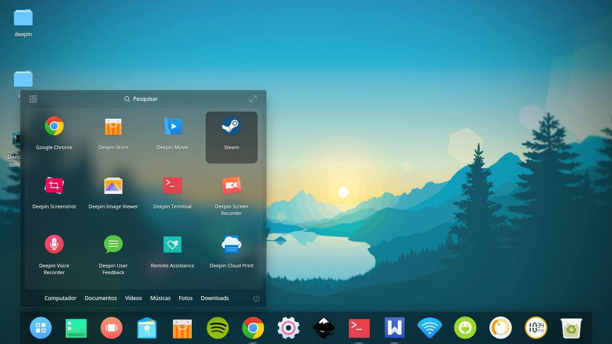

% Ce este și cum funcționează Linux?
% ThinkRoot99

În acest articol, vom explora conceptul de Linux și unele dintre atributele și componentele asociate sistemului de operare Linux.

# Ce este Linux?

**Linux** este un sistem de operare cu sursă deschisă, dezvoltat de o comunitate, având în centrul său nucleul, alături de alte instrumente, aplicații și servicii.

La fel ca orice alt sistem de operare, precum **Windows** sau **macOS**, Linux gestionează resursele hardware ale unui sistem, cum ar fi procesorul, memoria RAM și spațiul de stocare. Nucleul asigură interfața dintre sistemul de operare și hardware-ul de bază și facilitează comunicarea dintre cele două.

# Ce este linia de comandă în Linux?

O linie de comandă este o interfață care vă permite să introduceți și să executați comenzi Linux care indică sistemului de operare ce acțiuni să efectueze. O interfață de linie de comandă este furnizată de un terminal sau de un emulator de terminal, cum ar fi `GNOME Terminal`, `Konsole` sau `xterm`.

Lucrul în linia de comandă este modalitatea ideală de administrare a unui sistem Linux, în special atunci când se lucrează cu un server headless sau cu un sistem minimalist (un sistem Linux care nu oferă o interfață grafică).

> 

# Cum funcționează Linux?

În centrul fiecărui sistem Linux se află nucleul. Nucleul este ceea ce diferențiază Linux de alte sistem de operare. Este componenta centrală a sistemului de operare și acționează ca o punte de legătură între aplicațiile la nivel de utilizator și componentele hardware de bază.

Acesta permite comunicarea dintre programe si hardware-ul fizic de bază. Nucleul gestionează toate procesele care rulează, memoria, fișierele și așa mai departe. Pe scurt, nucleul se ocupă de următoarele:

- **Gestionarea memoriei** - Nucleul ține evidența utilizării memoriei de către diferitele aplicații din sistem.
- **Gestionarea dispozitivelor** - De asemenea, gestionează diverse dispozitive care sunt conectate la sistem, cum ar fi dispozitivele de intrare și ieșire.
- **Gestionarea proceselor** - Nucleul gestionează procesele în desfășurare pentru a evita conflictele și blocajele și, de asemenea, pentru funcționarea optimă a sistemului.
- **Apelurile de sistem și de securitate** - Nucleul primește și gestionează cererile de servicii din partea proceselor.

După cum am menționat anterior, nucleul se află chiar în miljocul proceselor utilizatorului și al hardware-ului de bază, care cuprinde memoria RAM, procesorul, dispozitivele de I/O, stocarea, grafica și rețeaua.

În afară de nucleu, sistemul de operare Linux include și alte componente esențiale, cum ar fi instrumentele GNU, utilitățile de sistem, aplicațiile instalate și multe altele. Toate acestea, reunite împreună, constituie un sistem de operare funcțional.

# Ce este un mediu de lucru în Linux?

Un mediu de lucru este o colecție de componente care oferă o interfață grafică pentru utilizatori și care permite utilizatorilor să interacționeze fără probleme cu sistemul de operare. Această colecție de componente curpinde elemente grafice, cum ar fi pictograme, meniuri, ferestre, bare de activități, imagini de fundal, widget-uri și panouri, pentru a menționa doar câteva.

În distribuțiile moderne de Linux cu interfață grafică, cum ar fi Debian, Ubuntu, Fedora, Rocky și AlmaLinux, un mediu de lucru este oferit implicit. Acesta a îmbunătățit interacțiunea cu utilizatorul și permite utilizatorilor să gestioneze cu ușurință sistemul, spre deosebire de interfața de linie de comandă, a cărei utilizare necesită un set de competențe ridicate.

Printre exemplele de medii de lucru populare se numără GNOME, Cinnamon, KDE Plasma, MATE, Deepin, Xfce, LXDE și LXQt.

> 

# Linux și Open Source

 Linux este un sistem de operare liber și cu sursă deschisă, care a fost lansat inițial pentru publicul larg în 1991. În prezent, acesta se află sub Licența Publică Generală GNU (GPL). Open Source implică faptul că oricine poate studia, modifica și redistribui codul sursă, cu condiția să facă acest lucru în conformitate cu termenii licenței GNU GPL.

De-a lungul timpului, Linux a crescut cu pași repezi și a devenit unul dintre cele mai mari proiecte open source din lume. A cucerit inimile profesioniștilor IT, ale iubitorilor de calculatoare și ale pasionaților din întreaga lume.

Se bucură de o comunitate largă de dezvoltatori dinamici și neobosiți care contribuie la nucleu, caută și repară defectele, adaugă noi caracteristici și dezvoltă idei noi, împărtășind în același timp punctele de vedere și opiniile lor cu comunitatea.

# Ce este o distribuție?

Există o mulțime de distributții Linux, iar alegerea celei potrivite se rezumă de obicei la ceea ce doriți să realizați cu ea. Înainte de a opta pentru distribuția aleasă, merita să vă faceți timp pentru a vă familiariza cu diferențele și nuanțele care există între diversele distribuții Linux.

La prima vedere, distribuțiile Linux diferă în următoarele moduri:

- **Gestionarea pachetelor** - Acesta este modul în care sunt instalate și gestionate pachetele. Distribuțiile Debian folosesc `apt`, variantele Red Hat folosesc `dnf`, distribuțiile SUSE folosesc `zypper`, iar distribuțiile Arch Linux folosesc `pacman`, pentru a menționa câteva exemple.
- **Costul** - Este complet gratuit, pe bază de abonament (în cazul RHEL și SUSE) sau parțial plătit, în cazul suportului pentru clienți pe bază de abonament.
- **Documentație** - Documentație și manuale extinse sau lipsa acestor.
- **Calitatea programelor** - Unele distribuții oferă cele mai recente versiuni de programe, în timp ce altele nu.
- **Asistență pentru clienți** - Furnizorul oferă sau nu asistență utilizatorilor.
- **Ușurința de utilizare** - Cele mai multe dintre distribuții sunt ușor de folosit și ușor de utilizat.

Ținând cont de acest lucru, alegerea distribuției potrivite este în mare parte o chestiune personală și depinde de obiectivul dumneavoastră. Așadar, iată o defalcare a distribuțiilor Linux potrivite pentru anumite cazuri de utilizare:

## Distribuții Linux prietenoase pentru începători

Atunci când vine vorba de alegerea unei distribuții Linux pentru cursanți sau începători, **Ubuntu** conduce detașat. Este o distribuție compet gratuită și open source, care oferă o interfață intuitivă și ușor de utilizat, oferind o experiență de utilizare fără probleme.

De asemenea, primiți din start aplicațiile esențiale necesare pentru a începe să lucrați, cum ar fi suita LibreOffice, navigatorul Firefox, player audio și video, vizualizator de imagini, instrument pentru captura de ecran, clientul de e-mail Thunderbird, calendar și multe altele. Este extrem de personalizabil și versatil.

Alte distribuții pentru începători sunt **Linux Mint**, **Zorin OS**, **elementary OS**, **MX Linux** și **Linux Lite**. Este demn de remarcat faptul că majoritatea acestora au la bază fie Debian, fie Ubuntu.

## Distribuții Linux intermediare și avansate

Pentru utilizatorii intermediari și avansați, cum ar fi dezvoltatorii, inginerii și administratori de sistem, se recomandă **Debian**, **SUSE Linux**, **RHEL**, **Rocky Linux**, **AlmaLinux** și **Fedora**.

Acestea sunt soluții universale excelente, care pot fi utilizate atât ca distribuții pentru calculatoare, cât și în configurații de întreprindere care gestionează sarcini de lucru de producție.

## Distribuții Linux pentru servere

Distribuțiile Linux optimizate pentru mediile de servere, incusiv implementările bare-metal și cloud, sunt: **RHEL**, **SUSE Linux Enterprise Server** (SLES), **Debian stable**, **Ubuntu Server** și **Fedora** (Fedora Server și Fedora CoreOS pentru sarcini de lucru cu containere).

Acestea sunt considerate ideale datorită performanțelor ridicate, stabilității impresionante și securității lor.

## Distribuții Linux pentru scopuri multimedia

Pentru artiști, creatori de conținut și producători de conținut multimedia, **Ubuntu Studio** și **Fedora Designe Suite** sunt foarte utile.

## Distribuții Linux axate pe securitate

**Kali Linux**, **Black Arch** și **Parrot OS** sunt distribuții Linux considerate ideale pentru sarcini legate de securitate, cum ar fi testarea penetrării și analiza criminalistică digitală.

# Concluzie

Aceasta a fost o scurtă introducere în Linux. Am abordat subiecte secundare esențiale, cum ar fi diversele medii de lucru și sfaturi despre cum puteți alege distribuția Linux potrivită pentru sarcinile de zi cu zi.

Fie că sunteți începător sau un administrator de sistem sau inginer experimentat, există o distribuție pentru fiecare.

# Sugestii pentru articol

**Sugestiile pentru actualizarea sau corectarea articol-ului se pot face pe [GitHub](https://github.com/thinkroot99/articole-linux). Mulțumesc**
