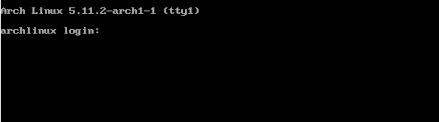
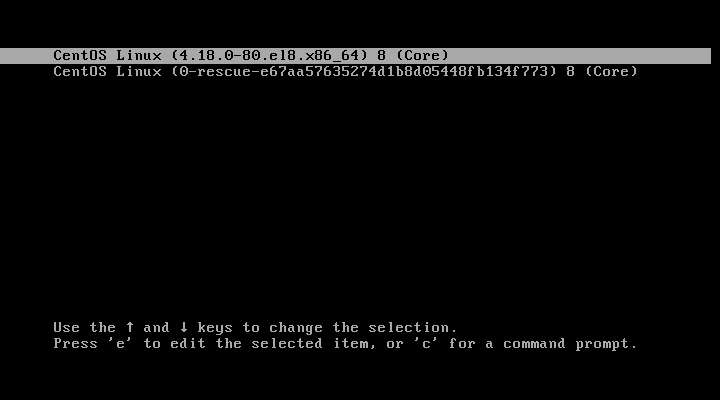
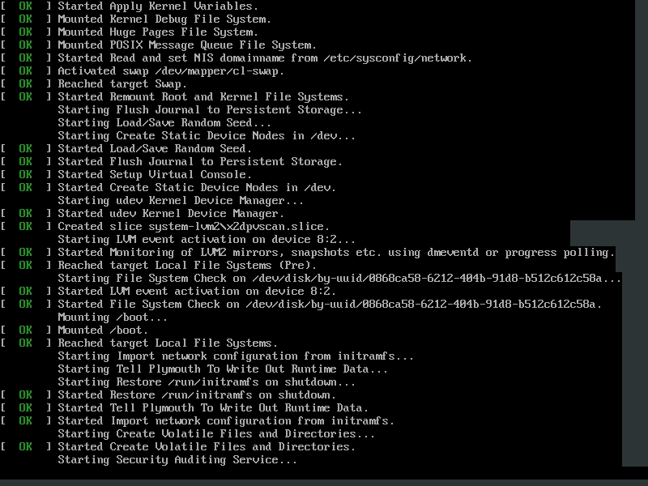

% Un ghid de bază pentru procesul de pornire Linux
% ThinkRoot99

De fiecare dată când porniți calculatorul cu Linux, acesta trece printr-o serie de etape înainte de a afișa în cele din urmă un ecran de conectare care vă solicită numele de utilizator sau parola.

Există 4 etape distincte prin care trece fiecare distribuție Linux în cadrul unui proces tipic de pornire.

> 

În acest ghid, vom evidenția diferiți pași parcurși de sistemul de operare Linux din momentul în care este pornit și până când vă conectați. Vă rog să rețineți că acest ghid ia în considerare doar încărcătorul de pornire **GRUB2** și **systemd init**, deoarece acestea sunt utilizate în prezent de marea majoritate a distribuțiilor Linux moderne.

Procesul de pornire se desfășoară în urmatorii 4 pași pe care îi vom discuta mai în detaliu:

- Verificarea integrități sistemului BIOS (POST)
- Pornirea încărcătorului de pornire (GRUB2)
- Inițializarea nucleului
- Pornirea systemd, părintele tuturor proceselor

# 1. Verificarea integrități sistemului BIOS (POST)

Procesul de pornire este inițializat, de obicei, atunci când un utilizator apasă butonul de pornire - dacă calculatorul a fost deja oprit - sau repornește sistemul folosind fie GUI (Graphical User Interface), fie linia de comandă.

Atunci când sistemul Linux pornește, **BIOS-ul (Basic Input Output System)** intră în funcțiune și efectuează un **Power On Self Test (POST)**. Aceasta este o verificare a integrității care efectuează o multitudine de verificări de diagnosticare.

**POST** testează operabilitatea hardware a unor componente cum ar fi HDD sau SSD, tastatura, memoria RAM, porturile USB și orice altă piesă hardware. Dacă nu este detectat vreun dispozitiv hardware sau dacă există o defecțiune, cum ar fi un HDD sau SSD corupt, pe ecran apare un mesaj care vă solicită intervenția.

În unele cazuri, se va auzi un semnal sonor, în special în cazul în care lipsește un modul RAM. Cu toate acestea, dacă hardware-ul respectiv este prezent și funcționează conform așteptărilor, procesul de pornire trece la următoarea etapă.

# 2.  Încărcătorul de pornire (GRUB2)

După ce **POST** este finalizat și lista de așteptare este liberă, **BIOS-ul** verifică **MBR-ul (Master Boot Record)** pentru a afla informații despre încărcătorul de pornire și partiționarea discului.

**MBR** este un cod de 512 octeți care este localizat pe primul sector al hard disk-ului, care este de obicei `/dev/sda` sau `/dev/hda`, în funcție de arhitectura hard disk-ului dumneavoastră. Cu toate acestea, rețineți că, uneori, **MBR-ul** poate fi loclizat pe o versiune **Live USB** sau pe un **DVD** de instalare cu Linux.

Există 3 tipuri principale de încărcătoare de pornire în Linux: **LILO**, **GRUB** și **GRUB2**. Încărcătorul de pornire GRUB2 este cel mai recent și principalul încărcător de pornire din distribuțiile Linux moderne și explică decizia de a renunța la celelalte două, care au devenit învechite odată cu trecerea timpului.

**GRUB2** înseamnă **GRand Unified Bootloader** versiunea 2. Odată ce **BIOS-ul** localizează încărcătorul de pornire GRUB2, acesta îl pornește și îl încarcă în memoria principală (RAM).

Meniul din GRUB2 vă permite să faceți câteva lucruri. Vă permite să selectați versiunea de nucleu pe care doriți să o utilizați. Dacă v-ați actualizat sistemul de câteva ori, este posibil să vedeți enumerate diferite versiuni de nucleu. În plus, vă oferă posibilitatea de a edita unii parametri ai nucleului prin apăsarea unei combnații de taste.

> 

De asemenea, într-o configurație cu două sau mai multe sisteme de operare, meniul grub vă permite să selectați sistemul de operare în care doriți să îl porniți. Fișierul de configurare pentru grub2 este fișierul `/boot/grub2/grub2.cfg`. Obiectivul principal al GRUB este de a încărca nucleul Linux în memoria principală.

# 3. Inițializarea nucleului

Nucleul este inima oricărui sistem Linux. Acesta face legătura între hardware-ul calculatorului și procesele care stau la baza acestuia. Nucleul controlează toate procesele de pe sistemul Linux. Odată ce nucleul Linux selectat este pornit de încărcătorul de pornire, acesta trebuie să se autoextragă din versiunea sa comprimată înainte de a întreprinde orice sarcină. După autoextragere, nucleul selectat montează sistemul de fișiere rădăcină și inițiază programul `/sbin/init`, denumit în mod obișnuit **init**.

> 

**Init** este întotdeauna primul program care se execută și i se atribuit ID-ul de proces sau PDI-ul 1. Acesta este procesul de init care generează diveriți regiștri (daemon) și montează toate partițiile specificate în fișierul `/etc/fstab`.

Nucleul montează apoi discul RAM (**initrd**), care este un sistem de fișiere de bază temporar până când este montat adevăratul sistem de fișiere de bază. Toate nucleele sunt localizate în directorul `/boot` împreună cu imaginea initială a discului RAM.

# 4. Pornirea Systemd

În cele din urmă, nucleul încarcă **Systemd**, care înlocuiește vechiul **SysV init**. **Systemd** este mama tuturor proceselor din Linux și gestionează, printre altele, montarea sistemelor de fișiere, pornirea și oprirea serviciilor, pentru a menționa doar câteva dintre acestea.

Systemd utilizează fișierul `/etc/systemd/system/default.target` pentru a determina situația sau obiectivul de pornire a sistemului Linux.

- Pentru o stație de lucru de birou (cu o interfața grafică), valoarea implicită a obiectibului este 5, care este echivalentul nivelului de execuție 5 pentru vechul SystemV init.
- Pentru un server, valoarea implicită a obiectibului este **multi-user.target**, care corespunde nivelului de execuție 3 din SysV init.

Iată o defalcare a obiectivelor systemd:

- **poweroff.target (nivelul de execuție 0)**: Închiderea (poweroff) sau oprirea (shutdown) sistemului.
- **rescue.target (nivelul de execuție 1)**: Lansează o sesiunea de salvare.
- **multi-user.target (nivelul de execuție 2,3,4)**: Configurează sistemul într-un sistem multiutilizator fără grafică (consolă).
- **graphical.target (nivelul de execuție 5)**: Configurează sistemul pentru a utiliza o interfață multiutilizator grafică cu servicii de rețea.
- **reboot.target (nivelul de execuție 6)**: Repornește sistemul.

Pentru a verifica obiectivul curent de pe sistemul dumneavoastră, rulați comanda următoare:

    $ systemctl get-default

Puteți trece de la un obiectiv la altul executând următoarea comandă în terminal:

    $ init runlevel-value

De exemplu, init 3 configurează sistemul într-o stare fără grafică.

Comanda init 6 repornește sistemul, iar init 0 oprește sistemul. Asigurați-vă că folosiți comanda `sudo` atunci când doriți să treceți la aceste două obiective.

Procesul de pornire se încheie după ce systemd încarcă toți regiștrii și stabilește valoarea obiectivului sau a nivelului de execuție. În acest moment vi se solicită numele de utilizator și parola după care veți intra în sistemul Linux.

# Sugestii pentru articol

**Sugestiile pentru actualizarea sau corectarea articol-ului se pot face pe [GitHub](https://github.com/thinkroot99/articole-linux). Mulțumesc**