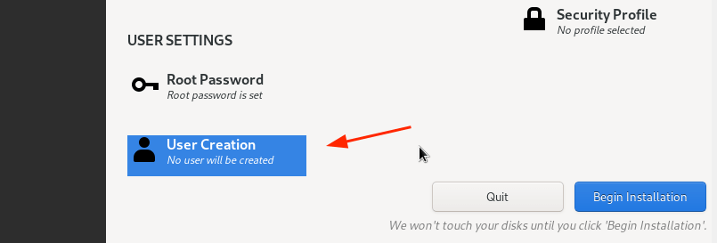

% Cum să descărcați și să instalați gratuit RHEL 9
% ThinkRoot99

**Red Hat Enterprise Linux 9** (RHEL 9), cu numele de cod Pow, este disponibil în general - în prezent versiunea 9.2.

**Red Hat** a făcut anunțul pe 18 mai 2022. Acest preia locul versiunii Beta, care a fost disponibilă din 3 noiembrie 2021.

**RHEL 9** reprezintă o serie de premiere în familia **Red Hat**. Este prima versiune majoră de la achiziția lui Red Hat de către **IBM** în iulie 2019 și prima versiune majoră de la deprecierea proiectului CentOS în favoarea lui **CentOS Stream**, care este în prezent versiunea ascendentă a RHEL.

RHEL 9 este cea mai recentă versiune majoră a RHEL și vine cu nucleul 5.14 și o serie de programe noi și o mulțime de îmbunătățiri. Acesta pune accentul pe securitate, stabilitate, flexibilitate și fiabilitate.

# Principalele caracteristici ale RHEL

Pe scurt, iată care sunt principalele caracteristici ale RHEL 9.

## Noi versiuni de programe

RHEL 9 este livrat cu noi versiuni de programe, inclusiv Python 3.9, Node.JS 16, GCC 11, Perl 5.32, Ruby 3.0, PHP 8.0 și multe alele.

## Îmbunătățiri de securitate

În **Red Hat Enterprise Linux 9**, configurația **OpenSSH** blochează autentificarea de la distanță de către utilizatorul root care utilizează autentificarea prin parolă. acest lucru împiedică atacatorii să pătrundă în sistem folosind atacuri prin forță brută.

În plus, politicile **SeLinux** au fost îmbunătățite pentru a spori securitatea. OpenSSL 3.0 introduce un concept de furnizor, o nouă schemă de versiuni și HTTPS îmbunătățit.

Unitățile RHEL încorporate au fost recompilate pentru a utiliza OpenSSL 3.0. Ca urmare, utilizatorii pot beneficia acum de noile cifre de securitate utilizate pentru criptare.

## Monitorizare

Consola web Red Hat Enterprise Linux 9 oferă pagini îmbunătățite de monitorizare și de măsurare a performanței care ajută la identificarea vârfurilor de utilzare a procesorului, a discului, a memoriei și a lățimii de bandă. Îm plus, aceste măsurători pot fi exportate pe serverul **Grafana** pentru o mai bună vizualizare.

Consola web suportă acum corecții live pentru nucleu. Puteți aplica cele mai recente corecții critice de sistem fără a reporni sau întrerupe serviciile în mediul de dezvoltare sau de producție.

## Instrumentul de construire a imaginii

[Instrumentul de creare a imagini](https://www.redhat.com/en/blog/using-no-cost-developer-subscription-new-red-hat-enterprise-linux-image-builder-hosted-service) permite utilizatorilor să creeze imagini de sistem RHEL personalizate în mai multe formate, atât pentru versiuni minore, cât și pentru versiuni majore.

Aceste imagini sunt compatibile cu principalii furnizori de cloud, cum ar fi **AWS** și **GCP**. Acest lucru face posibilă rotirea rapidă a mediilor de dezvoltare RHEL personalizate la fața locului și pe platformele de cloud.

În plus, puteți crea și imagini de instalare ISO de pornire (bootable) care sunt ambalate în format tarball. Puteți utiliza aceste imagini pentru a instala RHEL pe servere bare-metal sau ca mașină virtuală pe un hipervizor, cum ar fi **VMware**.

# Cum să descărcați gratuit RHEL 8

**Abonamentul Red Hat Developer** este o ofertă fără costuri a programului [Red Hat Developer](https://developers.redhat.com/about), adaptată pentru dezvoltatorii individuali care doresc să beneficieze de toate avantajele **Red Hat Enterprise Linux**.

Acesta oferă dezvoltatorilor acces la toate versiunile de RHEL, precum și la alte produse Red Hat, cum ar fi suplimente (addon), actualizări de programe și erate de securitate.

Înainte de orice altceva, asigurați-vă că aveți cont Red Hat activ. Dacă nu aveți încă cont, mergeți pe [portalul pentru clienți Red Hat](https://access.redhat.com/), faceți clic pe butonul „***Register***” și completați datele dumneavoastră pentru a vă crea un cont.

> 

După ce v-ați creat un cont Red Hat, sunteți gata să începeți să descărcați RHEL 9. Pentru a descărca Red Hat Enterprise Linux 9 fără niciun cost, accesați [Red Hat Developer Portal](https://developers.redhat.com/) și conectați-vă folosind datele de indentificare ale contului dumneavoastră.

În continuare, mergeți la pagina de descărcare a RHEL 9 și faceți clic pe butonul de descărcare prezentat mai jos.

> 

La scurt timp după aceea, va începe descărcarea imagini ISO RHEL 9. Ar trebui să vedeți un mesaj de confirmare care să vă informeze că descărcarea RHEL 9 este în curs.

> 

Dimensiunea de descărcare a imagini ISO este de aproximativ **8 GB**. Ca atare, asigurați-vă că aveți o conexiune la internet de mare viteză pentru o descărcare mai rapidă.

# Cum să instalați gratuit RHEL 9

După ce ați descărcat imaginea iso, luați o unitate USB de 16 GB și creați o unitate USB de pornire (bootable) folosind aplicații precum **UnetBootin** sau **Balena Etcher**.

Având la îndemână suportul de pornire, conectați-l la calculatorul pe care doriți să instalați RHEL 9 și reporniți sistemul.

Nu uitați să configurați BIOS/UEFI-ul pentru ca suportul de pornire să fie primul în prioritatea de pornire, astfel încât sistemul să pornească mai întâi de pe unitatea USB.

De asemenea, asigurați-vă că dispuneți de o conexiune la internet de mare viteză, care vă va fi utilă în timpul instalării.

## Pasul 1: Începeți instalarea lui RHEL 9

La repornirea sistemului, veți obține un ecran negru cu următoarele opțiuni. Pentru a începe instalarea, apăsați `ENTER` pe prima opțiune `Install Red Hat Enterprise Linux 9.0`.

> 

La scurt timp după aceea, pe ecran vor apărea următoarele mesaje de pornire. Nu va fi necesară nicio acțiune, așa că, așteptați cu răbdare în timp programul de instalare se pregătește să instaleze RHEL.

> 

După câteva secunde, apare asistenul grafic pentru instalarea Red Hat Enterprise Linux 9.0. În primul pas, selectați limba preferată și faceți clic pe `Continue`.

> 

## Pasul 2: Configurarea partițiilor

În următoarea etapă, veți vedea un rezumat al instalării, care este împărțit în patru secțiuni:

- Localization (localizare)
- Software (programe)
- System (sistem)
- USER Settings (setări pentru utilizator)

Ne vom concentra doar asupra a trei elemente care sunt obligatorii înainte de a continua cu instalarea - **Installation Destination**, **Root Account** și **Regular Account**.

> 

Pentru a configura partiționarea, faceți clic pe `Installation Destination` în secțiunea `SYSTEM`. Pe pagina `Installation Destination`, asigurați-vă că ați selectat opțiunea `Automatic` dacă doriți ca asistentul să partiționeze automat discul (hdd, ssd). În caz contrar, selectați `Custom` pentru a crea manual partițiile.

În plus, asigurați-vă că ați selectat hard disk-ul de pe calculator. Apoi faceti clic pe `Done`.

> 

Veți ajunge la fereastra `Manual Partitioning`. În mod implicit, este selectată schema de partitionare LVM, ceea ce este foarte bine.

Pentru a începe crearea partițiilor, faceți clic pe semnul plus `+`.

> 

În scop demonstrativ, vom crea următoarele partiții:

    /boot - 500 MB
    /home - 20 GB
    /root - 15 GB
    swap  - 8 GB

În primul rând, vom specifica opțiunea de pornire.

> 

Din tabelul de partiții de mai jos, puteți vedea că a fost creată partiția de boot.

> 

Repetați aceiași pași și creați punctele de montare /home, /root și swap.

Tabelul nostru complet de partiții este prezentat mai jos. Pentru a salva modificările, faceți clic pe `Done`.

> 

Apoi faceți clic pe `Accept Changes` în fereastra care apare.

> 

## Pasul 3: Configurați setările utilizatorului

În continuare, vom configura setările utilizatorului, începând cu parola pentru **Root**. Așadar, faceți clic pe pictograma `Root Password`.

> 

Deblocați contul **Root** furnizând o parolă de root și confirmați-o. Apoi, faceți clic pe `Done`.

> 

În continuare, creați un utilizator obișnuit de conectare făcând clic pe `User creation`.

> 

Furnizați detaliile privind numele de utilizator și parola utilizatorului și faceți clic pe `Done`.

> 

Acum suntem pregătiți să continuăm cu instalarea. Așadar, faceți clic pe `Begin Installation`.

> 

Asistentul va descărca toate pachetele necesare din imaginea **ISO RedHat** și le va salva pe hard disk. Acesta este un proces care durează destul de mult timp, iar aceasta este momentul ideal pentru a lua o pauză pe măsură ce instalarea avansează.

> 

După ce instalarea este finalizată, vi se va cere să reporniți sistemul pentru a vă putea conecta la noua instalare a **RHEL 9**.

Așadar, faceți clic pe butonul `Reboot System`.

> 

## Pasul 4: Poriți în Red Hat Enterprise Linux 9

După ce sistemul se repornește, selectați prima intrare din meniul **GRUB** care indică **Red Hat Enterprise Linux 9.0**.

> 

La scurt timp după aceea, furnizați parola pe ecranul de conectare și apăsați `ENTER`.

> 

După ce v-ați conectat, puteți opta să faceți un tur al RHEL 9 proaspăt instalat sau să refuzați și să mergeți direct la mediul de lucru.

> 

În cele din urmă, veți vedea mediul de lucru **GNOME 42**, care a primit o schimbare de aspect și arată destul de elegant.

> 

## Pasul 5: Activați Red Hat Subscription pe RHEL 9

După ce ați instalat RHEL 9, în sfârșit, înregistrați-vă abonamentul RHEL executând următoarea comandă în terminal. Numele de utilizator și parola sunt datele de conectare la contul dvs Red Hat.

    $ sudo subscription-manager register --username=username --password=password
    $ sudo subscription-manager attach --auto

Pentru a confirma că sistemul este înregistrat în RHSM (Red Hat Subscription Managament), rulați comanda:

    $ sudo subscription-manager list --installed  

Un exemplu de cum ar trebuie să apară în terminal după rularea comenzi de mai sus:

    thinkkroo99@linux: ~$
    thinkkroo99@linux: ~$ sudo subscription-manager list --installed
    +-----------------------------------------------+
        Installed Product Status
    +-----------------------------------------------+
    Product Name:   Red Hat Enterprise Linux for x86_64
    Product ID:     479
    Version:        9.0
    Arch:           x86_64
    Status:         Subscribed
    Status Details:
    Starts:         13/10/2023
    Ends:           12/10/2024
    
    thinkkroo99@linux: ~$
    thinkkroo99@linux: ~$

De aici, vă puteți bucura de toate bunătățile de la Red Hat, inclusiv cele mai recente programe, actualizări de securitate și remedieri de defecte.

> **Notă**: Puteți verifica întotdeauna detaliile abonamentului dvs. RHEL gratuit vizitând [portalul de gestionare a abonamentelor Red Hat](https://access.redhat.com/management).

> 

În acest fel, tutorialul se încheie. Sper că puteți descărca și instala confortabil și gratuit RHEL 9 (în prezent RHEL 9.2) fără probleme și, ulterior, să îl înregistrați pentru un abonament RHEL fără costuri pentru a beneficia de toate avantajele Red Hat Enterprise Linux.

# Sugestii pentru articol

**Sugestiile pentru actualizarea sau corectarea articol-ului se pot face pe [GitHub](https://github.com/thinkroot99/articole-linux). Mulțumesc**