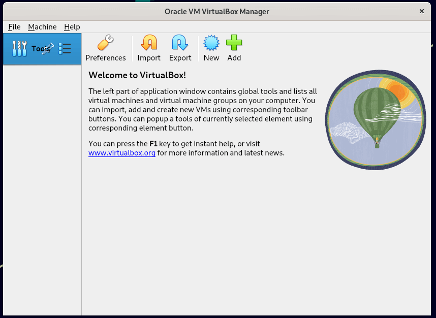
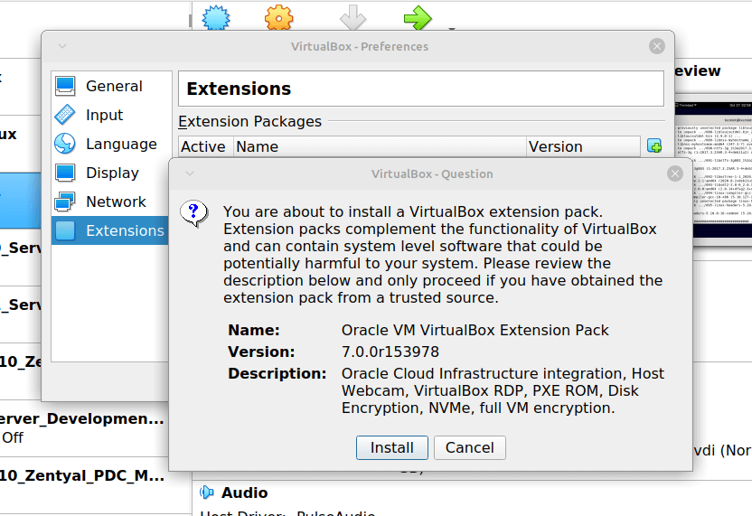

% Cum se instalează VirtualBox 7.0 pe distribuțiile bazate pe RHEL și Debian
$ ThinkRoot99

**VirtualBox** este un program de virtualizare open source multi-platformă, care poate fi instalat pe orice sistem de operare pentru a rula mai multe mașini virtuale pe același calculator.

De exemplu, dacă îl instalați pe sistemul Linux, puteți rula sistemul de operare Windows sub el ca sistem de operare secundar sau puteți rula sistemul de operare Linux pe sistemul Windows și așa mai departe.

În acest fel, puteți instala și rula cât de multe sisteme de operare (mașini virtuale) doriți, singura limită fiind spațiul pe disc și memoria RAM.

În octombrie 2022, **Oracle** a lansat versiunea stabilă majoră **VirtualBox 7.0**, cea mai nouă versiune de VirtualBox vin cu atât de multe schimbări majore și caracteristici noi adăugate.

Puteți vedea detaliile complete ale noilor modificări despre VirtualBox 7.0 pe [pagina oficială](https://www.virtualbox.org/wiki/Changelog-7.0).

Acest ghid explică cum să instalați VirtualBox 7.0 pe distribuții bazate pe `RPM` (RHEL), cum ar fi RHEL, Fedora, Rocky Linux, AlamaLinux și CentOS Strem, utilizănd propriul depozit VirtualBox cu ajutorul comenzilor `YUM` și `DNF`.

Acest ghid mai explică, de asemenea, cum să instalati VirtualBox 7.0 pe distribuții bazate pe `DEB` (Debian), cum ar fi sistemele Debian, Ubuntu, Linux Mint, Pop!_OS și Zorin Linux utilizănd propriul depozit VirtualBox cu ajutorul comenzilor `APT-GET` sau `APT`.

# Instalarea VirtualBox 7.0 în sistemele bazate pe RHEL

Pentru a instala cea mai recentă versiune stabilă a VirtualBox, trebuie mai întâi să descărcați fișierul de configurare `virtualbox.repo` utilizând următoarea comandă `wget` și apoi să importați cheia publică utilizând comanda `rpm`.

    -------------------------------- Pe distribuții bazate pe RHEL -------------------------------- 
    # wget https://download.virtualbox.org/virtualbox/rpm/rhel/virtualbox.repo -P /etc/yum.repos.d/
    # rpm --import https://www.virtualbox.org/download/oracle_vbox.asc
    
    --------------------------------------- Pe Fedora Linux ---------------------------------------
    # wget http://download.virtualbox.org/virtualbox/rpm/fedora/virtualbox.repo -P /etc/yum.repos.d/
    # rpm --import https://www.virtualbox.org/download/oracle_vbox.asc

În continuare, activați `depozitul EPEL` pentru a instala instrumentele de construcție și dependențele pe sistem.

    ------------------------ Pentru versiunile bazate pe RHEL 9 ------------------------ 
    # dnf install https://dl.fedoraproject.org/pub/epel/epel-release-latest-9.noarch.rpm
    
    ------------------------ Pentru versiunile bazate pe RHEL 8 ------------------------ 
    # yum install https://dl.fedoraproject.org/pub/epel/epel-release-latest-8.noarch.rpm
    
    ------------------------ Pentru versiunile bazate pe RHEL 7 ------------------------ 
    # yum install https://dl.fedoraproject.org/pub/epel/epel-release-latest-7.noarch.rpm

## Instalarea pachetelor necesare pentru VirtualBox

VirtualBox utilizează modulul de nucleu `vboxdrv` pentru a controla și a aloca memoria fizică pentru executarea sistemelor de operare. Fără acest modul, puteți utiliza în continuare VirtualBox pentru a crea și configura mașini virtuale, dar acestea nu vor funcționa.

Așadar, pentru ca VirtualBox să fie complet funcțional, va trebui mai întâi să vă actualizați sistemul, apoi să instalați câteva module suplimentare, cum ar fi `DKMS`, `kernel-headers`, `kernel-devel` și câteva dependențe.

    -------------------------------- Pe distribuții bazate pe RHEL -------------------------------- 
    # yum update
    # yum install binutils kernel-devel kernel-headers libgomp make patch gcc glibc-headers glibc-devel dkms -y
    
    --------------------------------------- Pe Fedora Linux ---------------------------------------
    # dnf update
    # dnf install @development-tools
    # dnf install kernel-devel kernel-headers dkms qt5-qtx11extras  elfutils-libelf-devel zlib-devel

## Instalarea VirtualBox 7.0 pe sistemele bazate pe RHEL

După ce ați instalat toate pachetele necesare, puteți instala cea mai recentă versiune de VirtualBox folosind următoarea comandă:

    # dnf install VirtualBox-7.0
    sau
    # yum install VirtualBox-7.0

În acest moment, sunteți gata să începeți să utilizați VirtualBox prin rularea următoarei comenzi în terminal:

    # virtualbox

Dacă primiți următorul mesaj în timpul instalării VirtualBox, înseamnă că există un conflict între cele două versiuni de nucleu.

    This system is currently not set up to build kernel modules.
    Please install the Linux kernel "header" files matching the current kernel

Pentru a rezolva problema, mai întâi, verificați nucleul instalat și apoi actualizați nucleul prin rularea comenzii:

    # uname -r
    # dnf update kernel-*
    sau
    # yum update kernel-*

Când actualizarea este completă, reporniți sistemul și selectați cel mai recent nucleu din meniul de boot al **GRUB**, această opțiune este de obicei prima, după cum puteți vedea.

    # reboot

După ce sistemul s-a pornit, conectați-vă și confirmați înca o dată ca versiune `kernel-devel` să corespundă acum cu versiunea nucleului Linux.

    # rpm -q kernel-devel
    # uname -r

Apoi, reporniți procesul de instalare și confirmați că instalarea VirtualBox a avut succes prin prin rularea:

    # /sbin/vboxconfig
    # systemctl status vboxdrv

## Depistarea problememlor

Dacă primiți vreun mesaj ca `KERN_DIR` sau dacă directorul sursă al nucleului nu este detectat automat de procesul de compilare, îl puteți seta folosind următoarea comanda.

Asigurați-vă că modificați versiune nucleului în funcție de sistemul dvs., așa cum este indicat mai jos cu text îngroșat.

    # KERN_DIR=/usr/src/kernels/**4.19.0-1.el7.elrepo.x86_64**
    # export KERN_DIR

# Instalarea VirtualBox 7.0 în Debian, Ubuntu și Linux Mint

Pentru a instala cea mai recentă versiune stabilă a VirtualBox, trebuie să adăugați depozitul oficial VirtualBox folosind urătoarea comandă:

    $ wget -q https://www.virtualbox.org/download/oracle_vbox_2016.asc -O- | sudo apt-key add -
    $ wget -q https://www.virtualbox.org/download/oracle_vbox.asc -O- | sudo apt-key add -
    $ sudo apt install software-properties-common
    $ echo "deb [arch=amd64] https://download.virtualbox.org/virtualbox/debian $(lsb_release -sc) contrib" | sudo tee /etc/apt/sources.list.d/virtualbox.list

Apoi, actualizați lista de programe și instalați cea mai recentă versiune de VirtualBox.

    $ sudo apt update
    $ sudo apt-get install virtualbox-7.0

Executați pur și simplu următoarea comandă pentru a-l porni din terminal sau folosiți programul de lansare din meniu pentru a-l porni.

    # virtualbox

## Captură de ecran a VirtualBox 7.0

> 

# Instalarea VirtualBox Extension Pack în Linux

Dacă aveți nevoie de unele funcționalități suplimentare, cum ar fi `VirtualBox RDP`, `PXE`, `ROM` cu suport pentru `E1000` și suport pentru unitatea de control `USB 2.0`, etc. Trebuie să descărcați și să instalați [VirtualBox Extension Pack](https://www.virtualbox.org/wiki/Downloads) utilizând următoarea comandă `wget`.

    # wget https://download.virtualbox.org/virtualbox/7.0.0/Oracle_VM_VirtualBox_Extension_Pack-7.0.0.vbox-extpack

Pentru a instala pachetul de extensie, trebuie să aveți instalat VirtualBox 7.0, după ce ați descărcat `vbox-extpack` deschideți cu VirtualBox așa cum se arată mai jos.

Dacă nu funcționează, atunci deschideți ***VirtualBox - File - Preferences - Tools - Extension Manager*** și căutați `vbox-extpack` pentru a-l instala.

> 

# Actualizaarea VirtualBox în sistemele Linux

Dacă doriți să actualizați VirtualBox cu cea mai recentă versiune în viitor, puteți rula pur și simplu următoarea comandă pentru a-l actualiza.

    -------------------------------- Pe distribuții bazate pe RHEL -------------------------------- 
    # yum update VirtualBox-*
    
    -------------------------------- Pe distribuții bazate pe Debian --------------------------------
    # apt-get install VirtualBox-*

# Îndepărtați VirtualBox din sistemele Linux

În cazul în care doriți să eliminați complet VirtualBox, utilizați următoarea comandă pentru a-l elimina complet din sistem.

    -------------------------------- Pe distribuții bazate pe RHEL -------------------------------- 
    # cd /etc/yum.repos.d/
    # rm -rf virtualbox.repo
    # yum remove VirtualBox-*
    
    -------------------------------- Pe distribuții bazate pe Debian --------------------------------
    # apt-get remove VirtualBox-*

De asemenea, puteți [descărca VirtualBox 7.0](https://www.virtualbox.org/wiki/Downloads) pentru alte platforme Linux, Windows și macOS.

# Sugestii pentru articol

**Sugestiile pentru actualizarea sau corectarea articol-ului se pot face pe [GitHub](https://github.com/thinkroot99/articole-linux). Mulțumesc**